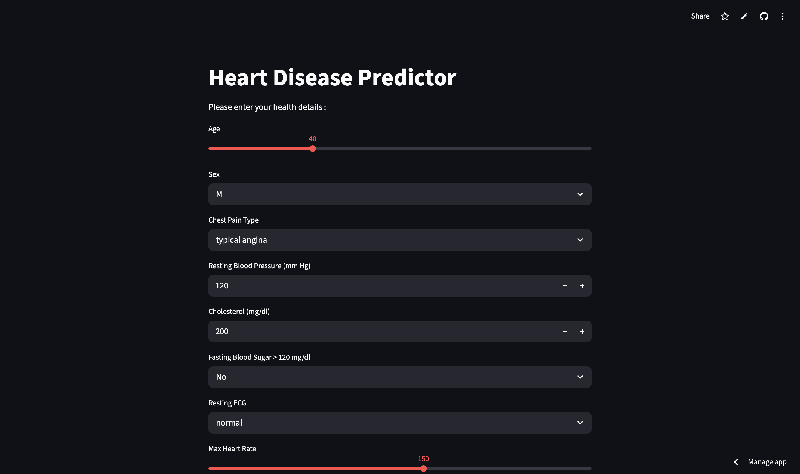
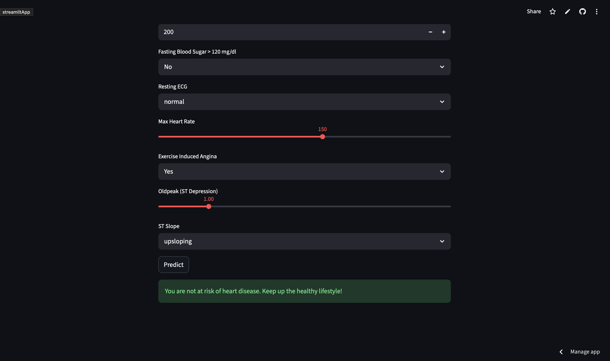

# CardioPredict-Ai

The **CardioPredict-Ai** is a machine learning-powered web application that provides a simple and interactive user interface to predict a person's risk of heart disease based on various health metrics and medical attributes.

The app uses a trained **Logistic Regression** model along with a pre-fitted scaler to process user inputs and deliver an instant prediction. 

## Features

- **Interactive UI**: Sliders, dropdowns, and number inputs to easily capture patient data.
- **Real-time Prediction**: Click "Predict" to instantly evaluate the risk of heart disease.
- **Comprehensive Medical Inputs**:
  - Age & Sex
  - Chest Pain Type
  - Resting Blood Pressure & Cholesterol
  - Fasting Blood Sugar
  - Resting ECG Results
  - Maximum Heart Rate
  - Exercise-Induced Angina
  - ST Depression (Oldpeak) and ST Slope

## Screenshots




## Installation and Setup

1. **Clone the repository:**
   ```bash
   git clone <your-repo-url>
   cd "CardioPredict Ai"
   ```

2. **Install the required dependencies:**
   Ensure you have Python 3 installed. Then, run:
   ```bash
   pip install -r requirements.txt
   ```

3. **Run the application:**
   ```bash
   streamlit run app.py
   ```

4. **Access the Web App:**
   Open your browser and navigate to `http://localhost:8501`.

## Project Structure

- `app.py`: The main Streamlit application script.
- `HeartDiseasePredictor.ipynb`: Jupyter Notebook containing the data exploration, preprocessing, and model training steps.
- `Logistic_Regression_Heart_Model.pkl`: The trained Logistic Regression model.
- `scaler.pkl`: The saved scaler used to normalize input data before prediction.
- `columns.pkl`: The expected feature columns for the model.
- `heart.csv`: The dataset used to train the machine learning model.
- `requirements.txt`: Python dependencies required to run the project.

## Dependencies

- `streamlit`
- `pandas`
- `numpy`
- `scikit-learn`
- `joblib`
